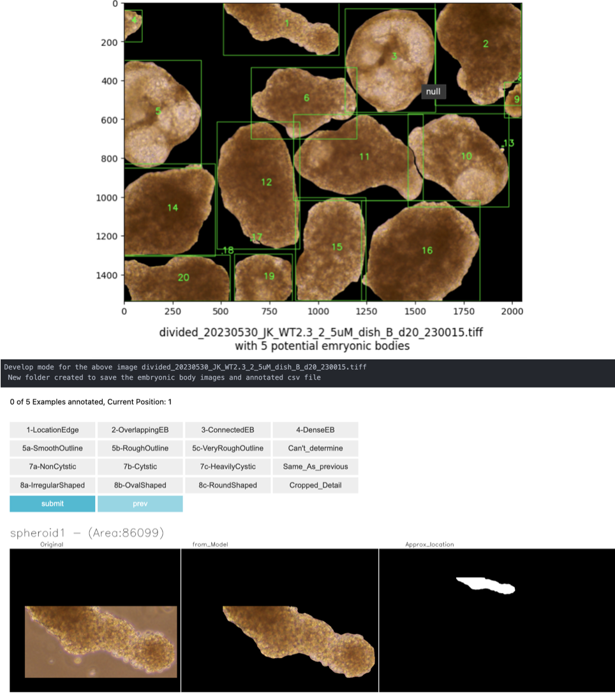

# Project Overview

This project provides a streamlined pipeline and user-friendly interface for annotating biological tissue samples. The annotated data is exported for use in training Deep Learning models with PyTorch.

Features
- Tissue Enumeration Pipeline
- Automatically enumerates individual tissues for annotation.
- Interactive Annotation Interface
- Offers an easy-to-use, interactive interface for biologists to annotate tissue properties.
- Annotated properties are exported as pickle files, ready for training Deep Learning models in PyTorch.

